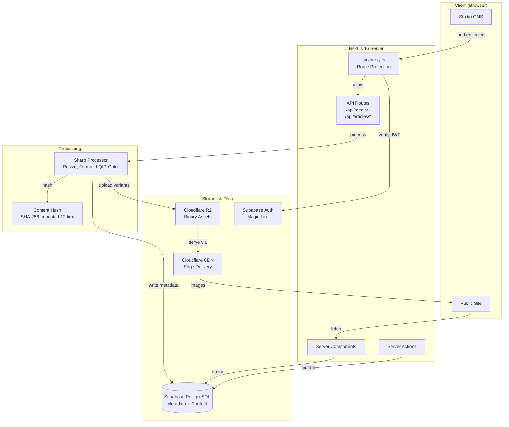
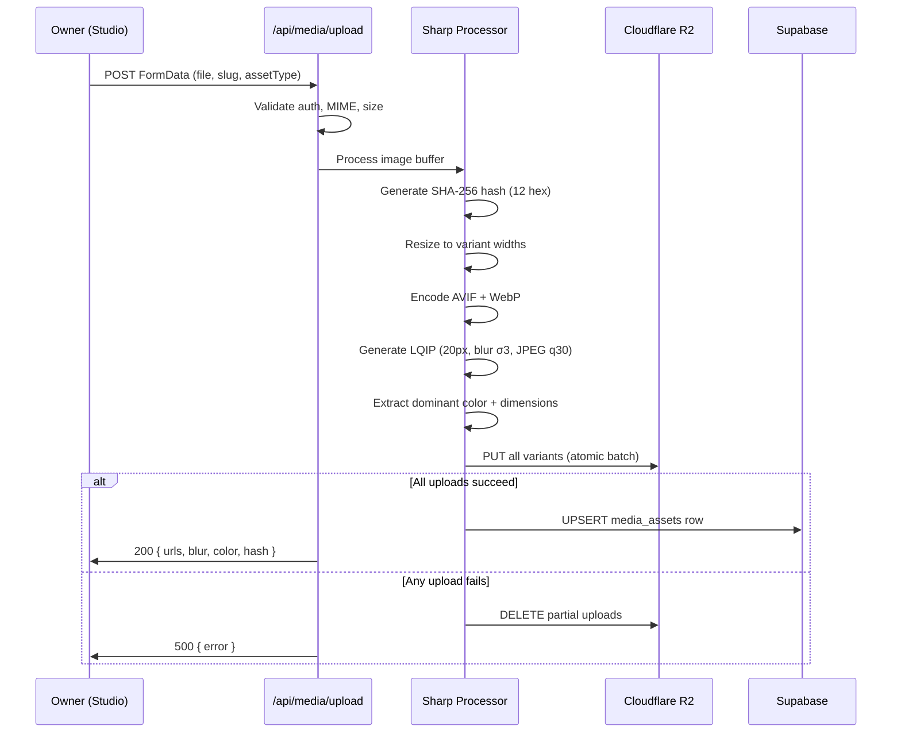

# Design Document: Platform Evolution Planning

## Overview

This design covers three major system evolutions for Comic Curated:

1. **Media Layer Migration** — Moving from local filesystem (`public/images/covers/`) to Cloudflare R2 with Sharp processing, CDN delivery, and structured metadata in Supabase.
2. **Studio CMS** — Replacing the utilitarian `/admin` route group with a cinematic `/studio` creative workspace using magic link auth, drag-and-drop interfaces, and live previews.
3. **News/Editorial System** — Introducing a full article publishing workflow with markdown editing, scheduled publishing, categories/tags, SEO, and premium editorial typography.

All three evolutions preserve the existing Next.js 16 + React 19 + Tailwind v4 + Supabase + GSAP + Framer Motion architecture. No new authentication providers, no `tailwind.config.js`, no breaking changes to the public site.

### Key Design Decisions

| Decision | Rationale |
|----------|-----------|
| Cloudflare R2 over Supabase Storage | S3-compatible API, zero egress fees, native CDN integration, custom domain support |
| Content-hash in R2 keys | Cache invalidation via URL change (no purge requests), deduplication |
| Magic link auth (replacing email/password) | Single owner, more secure, no password management |
| Markdown for articles | Portable, version-friendly, supports rich content with custom renderers |
| JSONB `variants` column | Flexible variant storage without schema changes when adding new sizes |
| Supabase cron for scheduled publishing | No external scheduler needed, runs within existing infrastructure |

---

## Architecture

### High-Level System Diagram



### Upload Flow Sequence



### Route Architecture

```mermaid
graph LR
    subgraph "Public Routes"
        HOME[/]
        LIB[/library]
        TITLE[/title/:slug]
        STATS[/stats]
        NEWS[/news]
        ART[/news/:slug]
    end

    subgraph "Studio Routes (Protected)"
        SLOG[/studio/login]
        SDASH[/studio]
        STIT[/studio/titles]
        SNEW[/studio/titles/new]
        SEDIT[/studio/titles/:slug]
        SART[/studio/articles]
        SANEW[/studio/articles/new]
        SAEDIT[/studio/articles/:slug]
        SMEDIA[/studio/media]
        SCUR[/studio/curation]
    end

    PROXY{proxy.ts} -->|protect| SDASH
    PROXY -->|protect| STIT
    PROXY -->|protect| SNEW
    PROXY -->|protect| SEDIT
    PROXY -->|protect| SART
    PROXY -->|protect| SANEW
    PROXY -->|protect| SAEDIT
    PROXY -->|protect| SMEDIA
    PROXY -->|protect| SCUR
```

---

## Components and Interfaces

### 1. Media Pipeline Components

#### R2 Client (`src/lib/r2-client.ts`)

```typescript
import { S3Client, PutObjectCommand, DeleteObjectCommand, ListObjectsV2Command } from '@aws-sdk/client-s3';

interface R2Config {
  accountId: string;
  accessKeyId: string;
  secretAccessKey: string;
  bucketName: string;
  publicUrl: string;
}

function validateR2Config(): R2Config {
  const required = ['R2_ACCOUNT_ID', 'R2_ACCESS_KEY_ID', 'R2_SECRET_ACCESS_KEY', 'R2_BUCKET_NAME', 'R2_PUBLIC_URL'];
  const missing = required.filter(key => !process.env[key]);
  if (missing.length > 0) {
    throw new Error(`[R2] Missing environment variables: ${missing.join(', ')}`);
  }
  return {
    accountId: process.env.R2_ACCOUNT_ID!,
    accessKeyId: process.env.R2_ACCESS_KEY_ID!,
    secretAccessKey: process.env.R2_SECRET_ACCESS_KEY!,
    bucketName: process.env.R2_BUCKET_NAME!,
    publicUrl: process.env.R2_PUBLIC_URL!,
  };
}

export function createR2Client(): S3Client {
  const config = validateR2Config();
  return new S3Client({
    region: 'auto',
    endpoint: `https://${config.accountId}.r2.cloudflarestorage.com`,
    credentials: {
      accessKeyId: config.accessKeyId,
      secretAccessKey: config.secretAccessKey,
    },
  });
}

export async function uploadToR2(key: string, body: Buffer, contentType: string): Promise<string>;
export async function deleteFromR2(key: string): Promise<void>;
export async function deleteR2Prefix(prefix: string): Promise<void>;
export function getR2PublicUrl(key: string): string;
```

#### Image Processor (`src/lib/image-processor.ts`)

```typescript
import { createHash } from 'crypto';

export type AssetType = 'cover' | 'banner' | 'article-image' | 'thumbnail' | 'og-asset';

export interface ProcessedVariant {
  width: number;
  format: 'avif' | 'webp';
  buffer: Buffer;
  size: number;
}

export interface ProcessingResult {
  contentHash: string;
  variants: ProcessedVariant[];
  blurDataUri: string;
  dominantColor: string;
  originalWidth: number;
  originalHeight: number;
  aspectRatio: number;
  mimeType: string;
}

const COVER_WIDTHS = [320, 480, 640, 1200];
const BANNER_WIDTHS = [768, 1200, 1920];
const ARTICLE_WIDTHS = [640, 1024, 1440];
const ALLOWED_MIMES = ['image/jpeg', 'image/png', 'image/webp', 'image/avif', 'image/gif'];
const MAX_FILE_SIZE = 10 * 1024 * 1024; // 10 MB

export function generateContentHash(buffer: Buffer): string {
  return createHash('sha256').update(buffer).digest('hex').slice(0, 12);
}

export function validateUpload(file: File): { valid: boolean; error?: string } {
  if (!ALLOWED_MIMES.includes(file.type)) {
    return { valid: false, error: `Invalid MIME type: ${file.type}. Allowed: ${ALLOWED_MIMES.join(', ')}` };
  }
  if (file.size > MAX_FILE_SIZE) {
    return { valid: false, error: `File size ${(file.size / 1024 / 1024).toFixed(1)}MB exceeds maximum 10MB` };
  }
  return { valid: true };
}

export async function processImage(buffer: Buffer, assetType: AssetType): Promise<ProcessingResult>;
```

#### Media Upload API (`src/app/api/media/upload/route.ts`)

```typescript
// POST /api/media/upload
// Body: FormData { file: File, slug: string, assetType: AssetType }
// Returns: { success: true, asset: MediaAssetRow }
// Errors: 401, 413, 415, 422, 503

export async function POST(request: NextRequest): Promise<NextResponse>;
```

#### Media Delete API (`src/app/api/media/delete/route.ts`)

```typescript
// DELETE /api/media/delete
// Body: { assetId: string }
// Returns: { success: true }
// Errors: 401, 404, 503

export async function DELETE(request: NextRequest): Promise<NextResponse>;
```

#### Migration Script (`scripts/migrate-to-r2.ts`)

```typescript
// Reads public/images/covers/ and public/images/banners/
// Uploads to R2 with proper bucket structure
// Creates media_assets rows in Supabase
// Generates migration report

interface MigrationReport {
  totalAssets: number;
  successful: number;
  failed: { slug: string; error: string }[];
  totalStorageBytes: number;
}

export async function migrateLocalToR2(): Promise<MigrationReport>;
```

### 2. Studio CMS Components

#### Studio Layout (`src/app/studio/layout.tsx`)

```typescript
// Isolated layout — no public nav/footer
// Uses same design system (globals.css tokens)
// Dark theme default, cinematic motion
// Includes StudioNav sidebar component

export default function StudioLayout({ children }: { children: React.ReactNode }): JSX.Element;
```

#### Studio Navigation (`src/components/studio/StudioNav.tsx`)

```typescript
// Cinematic sidebar navigation with:
// - Dashboard, Titles, Articles, Media, Curation sections
// - Animated active indicators (Framer Motion)
// - Collapsible on mobile
// - Session status indicator

interface StudioNavProps {
  currentPath: string;
}

export function StudioNav({ currentPath }: StudioNavProps): JSX.Element;
```

#### Title Editor (`src/components/studio/TitleEditor.tsx`)

```typescript
// Full title creation/editing form
// Integrates ImageUploader for covers/banners
// Genre/mood multi-select with existing taxonomy
// Markdown review editor with live preview

interface TitleEditorProps {
  mode: 'create' | 'edit';
  initialData?: TitleFormData;
  onSave: (data: TitleFormData) => Promise<void>;
}

export function TitleEditor({ mode, initialData, onSave }: TitleEditorProps): JSX.Element;
```

#### Tier Manager (`src/components/studio/TierManager.tsx`)

```typescript
// Drag-and-drop tier assignment
// Visual columns for each tier (SSS+, S, A, B, C, D, F)
// Title cards with cover thumbnails
// Uses @dnd-kit for accessible drag-and-drop

interface TierManagerProps {
  titles: AdminTitleRow[];
  onTierChange: (titleId: string, newTier: TierLevel) => Promise<void>;
}

export function TierManager({ titles, onTierChange }: TierManagerProps): JSX.Element;
```

#### Article Editor (`src/components/studio/ArticleEditor.tsx`)

```typescript
// Markdown editor with:
// - Syntax highlighting (via lightweight code mirror or textarea + preview)
// - Toolbar: headings, bold, italic, links, images, code blocks
// - Split-pane live preview
// - Word count + reading time display
// - Full-width preview mode

interface ArticleEditorProps {
  mode: 'create' | 'edit';
  initialData?: ArticleFormData;
  onSave: (data: ArticleFormData) => Promise<void>;
}

export function ArticleEditor({ mode, initialData, onSave }: ArticleEditorProps): JSX.Element;
```

#### Gallery Manager (`src/components/studio/GalleryManager.tsx`)

```typescript
// Per-title gallery management
// Drag-and-drop reordering
// Category assignment (best-scene, romantic-scene, etc.)
// Inline caption editing
// Upload integration with Image Pipeline

interface GalleryManagerProps {
  titleId: string;
  images: GalleryImage[];
  onReorder: (orderedIds: string[]) => Promise<void>;
  onUpload: (file: File, category: string, caption?: string) => Promise<void>;
  onDelete: (imageId: string) => Promise<void>;
}

export function GalleryManager(props: GalleryManagerProps): JSX.Element;
```

### 3. News/Editorial Components

#### News Landing Page (`src/app/news/page.tsx`)

```typescript
// Server component — fetches published articles
// Featured section (large cards) + grid of recent articles
// Category/tag filter controls
// Sorted by publish_date DESC

export default async function NewsPage({ searchParams }: { searchParams: Promise<{ category?: string; tag?: string }> }): Promise<JSX.Element>;
```

#### Article Page (`src/app/news/[slug]/page.tsx`)

```typescript
// Server component — fetches single article by slug
// Editorial typography (60-75 char line length)
// Featured image with blur-up
// Markdown rendering with custom components
// JSON-LD structured data
// Dynamic OG image generation

export default async function ArticlePage({ params }: { params: Promise<{ slug: string }> }): Promise<JSX.Element>;
```

#### Markdown Renderer (`src/components/news/MarkdownRenderer.tsx`)

```typescript
// Renders article markdown to React components
// Custom image handling (responsive srcset from media_assets)
// Code block syntax highlighting
// Typography: generous whitespace, readable line lengths

interface MarkdownRendererProps {
  content: string;
  className?: string;
}

export function MarkdownRenderer({ content, className }: MarkdownRendererProps): JSX.Element;
```

#### Article Card (`src/components/news/ArticleCard.tsx`)

```typescript
// Card component for news grid
// Featured image with blur placeholder
// Title, excerpt, category badge, date, reading time
// Hover animation (Framer Motion scale + shadow)

interface ArticleCardProps {
  article: ArticleSummary;
  featured?: boolean;
}

export function ArticleCard({ article, featured }: ArticleCardProps): JSX.Element;
```

### 4. Services Layer

#### Media Service (`src/services/media.ts`)

```typescript
export async function fetchMediaAsset(slug: string, assetType: AssetType): Promise<MediaAsset | null>;
export async function fetchMediaVariants(slug: string): Promise<MediaVariant[]>;
export async function getImageUrl(slug: string, width: number, format: 'avif' | 'webp'): Promise<string>;
```

#### Article Service (`src/services/articles.ts`)

```typescript
export async function fetchPublishedArticles(options?: { category?: string; tag?: string; limit?: number; offset?: number }): Promise<ArticleSummary[]>;
export async function fetchArticleBySlug(slug: string): Promise<Article | null>;
export async function fetchFeaturedArticles(): Promise<ArticleSummary[]>;
export async function fetchArticleCategories(): Promise<ArticleCategory[]>;
export async function fetchArticleTags(): Promise<ArticleTag[]>;
```

#### Studio Article Service (`src/services/studio-articles.ts`)

```typescript
export async function studioFetchAllArticles(): Promise<StudioArticleRow[]>;
export async function studioCreateArticle(data: ArticleFormData): Promise<string>;
export async function studioUpdateArticle(id: string, data: Partial<ArticleFormData>): Promise<void>;
export async function studioArchiveArticle(id: string): Promise<void>;
export async function studioDeleteArticle(id: string): Promise<void>;
export async function calculateReadingTime(body: string): number;
```

---

## Data Models

### Media Assets Table

```sql
CREATE TABLE media_assets (
  id              UUID        PRIMARY KEY DEFAULT gen_random_uuid(),
  slug            TEXT        NOT NULL,
  asset_type      TEXT        NOT NULL
    CHECK (asset_type IN ('cover', 'banner', 'article-image', 'thumbnail', 'og-asset')),
  content_hash    TEXT        NOT NULL,
  original_width  INTEGER,
  original_height INTEGER,
  aspect_ratio    NUMERIC(6,4),
  mime_type       TEXT,
  dominant_color  TEXT,
  blur_data_uri   TEXT,
  variants        JSONB       NOT NULL DEFAULT '[]'::jsonb,
  r2_base_path    TEXT,
  file_size_total INTEGER,    -- sum of all variant sizes in bytes
  created_at      TIMESTAMPTZ NOT NULL DEFAULT NOW(),
  updated_at      TIMESTAMPTZ NOT NULL DEFAULT NOW(),

  CONSTRAINT unique_asset UNIQUE (slug, asset_type, content_hash)
);

CREATE INDEX idx_media_slug ON media_assets(slug);
CREATE INDEX idx_media_type ON media_assets(asset_type);
CREATE INDEX idx_media_slug_type ON media_assets(slug, asset_type);
```

**Variants JSONB structure:**
```json
[
  { "width": 320, "format": "avif", "url": "https://cdn.comic-curated.com/covers/solo-leveling/a1b2c3d4e5f6/320w.avif", "size": 24576 },
  { "width": 320, "format": "webp", "url": "https://cdn.comic-curated.com/covers/solo-leveling/a1b2c3d4e5f6/320w.webp", "size": 28672 },
  { "width": 480, "format": "avif", "url": "...", "size": 40960 }
]
```

### Articles Table

```sql
CREATE TABLE articles (
  id                  UUID        PRIMARY KEY DEFAULT gen_random_uuid(),
  slug                TEXT        UNIQUE NOT NULL,
  title               TEXT        NOT NULL,
  subtitle            TEXT,
  body                TEXT        NOT NULL,
  excerpt             TEXT        CHECK (char_length(excerpt) <= 300),
  featured_image_id   UUID        REFERENCES media_assets(id) ON DELETE SET NULL,
  category_id         UUID        REFERENCES article_categories(id) ON DELETE SET NULL,
  publication_state   TEXT        NOT NULL DEFAULT 'draft'
    CHECK (publication_state IN ('draft', 'scheduled', 'published', 'archived')),
  publish_date        TIMESTAMPTZ,
  scheduled_date      TIMESTAMPTZ,
  featured            BOOLEAN     NOT NULL DEFAULT FALSE,
  seo_title           TEXT,
  seo_description     TEXT        CHECK (char_length(seo_description) <= 160),
  word_count          INTEGER     NOT NULL DEFAULT 0,
  reading_time_minutes INTEGER    NOT NULL DEFAULT 0,
  created_at          TIMESTAMPTZ NOT NULL DEFAULT NOW(),
  updated_at          TIMESTAMPTZ NOT NULL DEFAULT NOW()
);

CREATE INDEX idx_articles_state ON articles(publication_state);
CREATE INDEX idx_articles_publish_date ON articles(publish_date DESC);
CREATE INDEX idx_articles_category ON articles(category_id);
CREATE INDEX idx_articles_featured ON articles(featured) WHERE featured = TRUE;
CREATE INDEX idx_articles_slug ON articles(slug);
CREATE INDEX idx_articles_scheduled ON articles(scheduled_date)
  WHERE publication_state = 'scheduled';
```

### Article Categories Table

```sql
CREATE TABLE article_categories (
  id          UUID    PRIMARY KEY DEFAULT gen_random_uuid(),
  name        TEXT    UNIQUE NOT NULL,
  slug        TEXT    UNIQUE NOT NULL,
  description TEXT,
  color       TEXT,
  sort_order  INTEGER NOT NULL DEFAULT 0
);
```

### Article Tags Table

```sql
CREATE TABLE article_tags (
  id   UUID PRIMARY KEY DEFAULT gen_random_uuid(),
  name TEXT UNIQUE NOT NULL,
  slug TEXT UNIQUE NOT NULL
);
```

### Article Tag Assignments Junction

```sql
CREATE TABLE article_tag_assignments (
  article_id UUID NOT NULL REFERENCES articles(id) ON DELETE CASCADE,
  tag_id     UUID NOT NULL REFERENCES article_tags(id) ON DELETE CASCADE,
  PRIMARY KEY (article_id, tag_id)
);
```

### RLS Policies for New Tables

```sql
-- media_assets: public SELECT, owner-only write
ALTER TABLE media_assets ENABLE ROW LEVEL SECURITY;
CREATE POLICY "Public can view media_assets"
  ON media_assets FOR SELECT TO anon, authenticated USING (TRUE);
CREATE POLICY "Authenticated owner has full access to media_assets"
  ON media_assets FOR ALL TO authenticated USING (TRUE) WITH CHECK (TRUE);

-- articles: public SELECT only published + past publish_date
ALTER TABLE articles ENABLE ROW LEVEL SECURITY;
CREATE POLICY "Public can view published articles"
  ON articles FOR SELECT TO anon, authenticated
  USING (publication_state = 'published' AND (publish_date IS NULL OR publish_date <= NOW()));
CREATE POLICY "Authenticated owner has full access to articles"
  ON articles FOR ALL TO authenticated USING (TRUE) WITH CHECK (TRUE);

-- article_categories: public SELECT, owner write
ALTER TABLE article_categories ENABLE ROW LEVEL SECURITY;
CREATE POLICY "Public can view article_categories"
  ON article_categories FOR SELECT TO anon, authenticated USING (TRUE);
CREATE POLICY "Authenticated owner has full access to article_categories"
  ON article_categories FOR ALL TO authenticated USING (TRUE) WITH CHECK (TRUE);

-- article_tags: public SELECT, owner write
ALTER TABLE article_tags ENABLE ROW LEVEL SECURITY;
CREATE POLICY "Public can view article_tags"
  ON article_tags FOR SELECT TO anon, authenticated USING (TRUE);
CREATE POLICY "Authenticated owner has full access to article_tags"
  ON article_tags FOR ALL TO authenticated USING (TRUE) WITH CHECK (TRUE);

-- article_tag_assignments: public SELECT, owner write
ALTER TABLE article_tag_assignments ENABLE ROW LEVEL SECURITY;
CREATE POLICY "Public can view article_tag_assignments"
  ON article_tag_assignments FOR SELECT TO anon, authenticated USING (TRUE);
CREATE POLICY "Authenticated owner has full access to article_tag_assignments"
  ON article_tag_assignments FOR ALL TO authenticated USING (TRUE) WITH CHECK (TRUE);
```

### Scheduled Publishing (Supabase pg_cron)

```sql
-- Supabase cron job: runs every 5 minutes
SELECT cron.schedule(
  'publish-scheduled-articles',
  '*/5 * * * *',
  $$
    UPDATE articles
    SET publication_state = 'published',
        publish_date = scheduled_date,
        updated_at = NOW()
    WHERE publication_state = 'scheduled'
      AND scheduled_date <= NOW();
  $$
);
```

### TypeScript Types

```typescript
// src/types/media.ts
export interface MediaAsset {
  id: string;
  slug: string;
  assetType: AssetType;
  contentHash: string;
  originalWidth: number;
  originalHeight: number;
  aspectRatio: number;
  mimeType: string;
  dominantColor: string;
  blurDataUri: string;
  variants: MediaVariant[];
  r2BasePath: string;
  createdAt: string;
  updatedAt: string;
}

export interface MediaVariant {
  width: number;
  format: 'avif' | 'webp';
  url: string;
  size: number;
}

// src/types/article.ts
export type PublicationState = 'draft' | 'scheduled' | 'published' | 'archived';

export interface Article {
  id: string;
  slug: string;
  title: string;
  subtitle: string | null;
  body: string;
  excerpt: string | null;
  featuredImage: MediaAsset | null;
  category: ArticleCategory | null;
  tags: ArticleTag[];
  publicationState: PublicationState;
  publishDate: string | null;
  scheduledDate: string | null;
  featured: boolean;
  seoTitle: string | null;
  seoDescription: string | null;
  wordCount: number;
  readingTimeMinutes: number;
  createdAt: string;
  updatedAt: string;
}

export interface ArticleSummary {
  id: string;
  slug: string;
  title: string;
  subtitle: string | null;
  excerpt: string | null;
  featuredImage: { url: string; blurDataUri: string; dominantColor: string } | null;
  category: { name: string; slug: string; color: string } | null;
  publishDate: string;
  readingTimeMinutes: number;
  featured: boolean;
}

export interface ArticleCategory {
  id: string;
  name: string;
  slug: string;
  description: string | null;
  color: string | null;
  sortOrder: number;
}

export interface ArticleTag {
  id: string;
  name: string;
  slug: string;
}

export interface ArticleFormData {
  title: string;
  subtitle?: string;
  body: string;
  excerpt?: string;
  featuredImageId?: string;
  categoryId?: string;
  tagIds: string[];
  publicationState: PublicationState;
  scheduledDate?: string;
  seoTitle?: string;
  seoDescription?: string;
}
```

### Updated Proxy (`src/proxy.ts`)

```typescript
// Extended to protect /studio routes with magic link auth
// Redirects unauthenticated users to /studio/login
// Redirects authenticated users away from /studio/login
// Adds session expiration message parameter

export async function proxy(request: NextRequest) {
  // ... existing Supabase SSR client setup ...

  const isStudioRoute = request.nextUrl.pathname.startsWith('/studio');
  const isStudioLogin = request.nextUrl.pathname === '/studio/login';

  // Studio protection
  if (isStudioRoute && !isStudioLogin && !user) {
    const loginUrl = new URL('/studio/login', request.url);
    loginUrl.searchParams.set('redirectTo', request.nextUrl.pathname);
    loginUrl.searchParams.set('reason', 'session_expired');
    return NextResponse.redirect(loginUrl);
  }

  if (isStudioLogin && user) {
    return NextResponse.redirect(new URL('/studio', request.url));
  }

  // Legacy /admin redirect to /studio
  if (request.nextUrl.pathname.startsWith('/admin')) {
    return NextResponse.redirect(new URL('/studio', request.url));
  }

  return supabaseResponse;
}
```

### CoverImage Component Update

The existing `CoverImage` component will be updated to support both local and R2-served images:

```typescript
// Updated to accept either a slug (local) or a MediaAsset (R2)
interface CoverImageProps {
  // Existing props preserved
  slug: string;
  alt: string;
  blurDataURL?: string;
  dominantColor?: string;
  // New: R2 media asset for CDN delivery
  mediaAsset?: MediaAsset;
  // ... rest unchanged
}

// Resolution logic:
// 1. If mediaAsset provided → use CDN URLs from variants
// 2. If no mediaAsset → fall back to local /images/covers/{slug}-{width}w.avif
```

---

## Correctness Properties

*A property is a characteristic or behavior that should hold true across all valid executions of a system — essentially, a formal statement about what the system should do. Properties serve as the bridge between human-readable specifications and machine-verifiable correctness guarantees.*

### Property 1: Content Hash Determinism and Uniqueness

*For any* byte buffer, `generateContentHash(buffer)` SHALL produce a 12-character lowercase hexadecimal string, AND calling it twice on the same buffer SHALL produce the same result, AND calling it on two distinct buffers SHALL produce different results (with overwhelming probability).

**Validates: Requirements 1.2, 1.5, 3.3**

### Property 2: R2 Key Path Structure

*For any* valid slug, content hash, asset type, variant descriptor, and format, the generated R2 object key SHALL match the pattern `{assetType}/{slug}/{contentHash}/{descriptor}.{format}` where each segment contains only URL-safe characters.

**Validates: Requirements 1.1**

### Property 3: Upload Validation Correctness

*For any* file with a MIME type and size, the validation function SHALL return `{ valid: true }` if and only if the MIME type is one of `image/jpeg`, `image/png`, `image/webp`, `image/avif`, `image/gif` AND the file size is ≤ 10,485,760 bytes. All other inputs SHALL be rejected with a descriptive error message.

**Validates: Requirements 1.3, 1.4, 18.3**

### Property 4: Variant Generation Completeness

*For any* valid image buffer and asset type, the Sharp processor SHALL produce exactly `expectedWidths(assetType).length * 2` variants, where each expected width has both an AVIF and a WebP variant, and cover images use widths [320, 480, 640, 1200] while banner images use widths [768, 1200, 1920].

**Validates: Requirements 2.1, 2.2**

### Property 5: LQIP Format Invariant

*For any* valid image buffer processed by the Sharp processor, the generated LQIP string SHALL match the pattern `data:image/jpeg;base64,{validBase64}` where the base64 portion decodes to a valid JPEG image.

**Validates: Requirements 2.3**

### Property 6: Dominant Color Format

*For any* valid image buffer processed by the Sharp processor, the extracted dominant color SHALL be a 7-character string matching the regex `/^#[0-9a-f]{6}$/i`.

**Validates: Requirements 2.4**

### Property 7: Aspect Ratio Correctness

*For any* image with original dimensions (width, height) where both are positive integers, the computed aspect ratio SHALL equal `width / height` (within floating-point tolerance of ±0.001).

**Validates: Requirements 2.5**

### Property 8: Image URL Resolution

*For any* slug and asset type, the image URL resolver SHALL return a CDN URL (starting with the R2_PUBLIC_URL) when a `media_assets` row exists for that slug and asset type, AND SHALL return a local filesystem path (`/images/covers/{slug}-{width}w.{format}`) when no `media_assets` row exists.

**Validates: Requirements 6.2, 6.3**

### Property 9: Studio Route Protection

*For any* URL path starting with `/studio` (excluding `/studio/login`), an unauthenticated request SHALL be redirected to `/studio/login` with the original path preserved in a `redirectTo` query parameter.

**Validates: Requirements 7.3, 7.5**

### Property 10: R2 Configuration Validation

*For any* subset of the required R2 environment variables (`R2_ACCOUNT_ID`, `R2_ACCESS_KEY_ID`, `R2_SECRET_ACCESS_KEY`, `R2_BUCKET_NAME`, `R2_PUBLIC_URL`) being unset, the `validateR2Config()` function SHALL throw an error whose message contains the names of all missing variables.

**Validates: Requirements 4.3**

### Property 11: Article Sort Order

*For any* set of published articles returned by the public articles query, the list SHALL be sorted by `publish_date` in descending order (newest first).

**Validates: Requirements 11.2**

### Property 12: Scheduled Article Visibility

*For any* article with `publication_state = 'scheduled'` and `scheduled_date` in the future, the article SHALL NOT appear in public article query results.

**Validates: Requirements 11.6**

### Property 13: Reading Time Calculation

*For any* non-empty string body, `calculateReadingTime(body)` SHALL return `Math.ceil(wordCount / 200)` where `wordCount` is the number of whitespace-separated non-empty tokens in the body, and the word count SHALL equal the number of such tokens.

**Validates: Requirements 13.3**

### Property 14: Scheduled Publishing Transition

*For any* article with `publication_state = 'scheduled'` and `scheduled_date <= NOW()`, the publishing cron job SHALL transition the article to `publication_state = 'published'` and set `publish_date = scheduled_date`.

**Validates: Requirements 13.5, 19.1**

### Property 15: Category Filter Correctness

*For any* category filter applied to the articles query, all returned articles SHALL have a `category_id` matching the selected category.

**Validates: Requirements 14.4**

### Property 16: Tag Filter Correctness

*For any* tag filter applied to the articles query, all returned articles SHALL have an entry in `article_tag_assignments` linking them to the selected tag.

**Validates: Requirements 14.5**

### Property 17: SEO Field Resolution

*For any* article, the resolved SEO title SHALL equal `article.seo_title` when it is non-null, otherwise `article.title`. The resolved SEO description SHALL equal `article.seo_description` when it is non-null, otherwise `article.excerpt`.

**Validates: Requirements 15.2, 15.3**

### Property 18: Article Metadata Completeness

*For any* published article with a title, excerpt, and featured image, the generated HTML page SHALL contain `<meta property="og:title">`, `<meta property="og:description">`, `<meta property="og:image">`, `<meta property="og:type" content="article">` tags, AND a `<script type="application/ld+json">` block with `@type: "Article"`, `headline`, `datePublished`, and `image` fields.

**Validates: Requirements 15.1, 15.5**

### Property 19: Responsive Image Rendering in Articles

*For any* image reference in article markdown that has a corresponding `media_assets` row with variants, the rendered HTML SHALL contain an `` or `<picture>` element with a `srcset` attribute listing multiple width/format combinations from the asset's variants.

**Validates: Requirements 16.1**

### Property 20: Lazy Loading for Below-Fold Images

*For any* image component rendered without the `priority` flag, the output HTML element SHALL include `loading="lazy"` attribute.

**Validates: Requirements 16.3, 20.1**

### Property 21: Atomic Upload (No Partial Variants)

*For any* upload where variant K of N fails during R2 upload, all previously uploaded variants (1 through K-1) for that batch SHALL be deleted from R2, resulting in zero variants persisted for that upload attempt.

**Validates: Requirements 18.4**

### Property 22: Scheduled Publishing Idempotence

*For any* article that should have been published (scheduled_date <= NOW()) but was not transitioned due to a previous failure, the next execution of the publishing cron job SHALL successfully transition it to 'published' state.

**Validates: Requirements 19.4**

### Property 23: CLS Prevention via Aspect Ratio and Dominant Color

*For any* image rendered with known `aspectRatio` and `dominantColor` values, the container element SHALL have `aspect-ratio` CSS property set to the image's aspect ratio AND `background-color` set to the dominant color, preventing layout shift during image load.

**Validates: Requirements 20.5**

---

## Error Handling

### Media Pipeline Errors

| Error Condition | HTTP Status | Response | Recovery |
|----------------|-------------|----------|----------|
| Unauthenticated request | 401 | `{ error: "Unauthorized" }` | Redirect to login |
| Invalid MIME type | 415 | `{ error: "Invalid MIME type: {type}. Allowed: ..." }` | User selects valid file |
| File too large (>10MB) | 413 | `{ error: "File size exceeds maximum 10MB" }` | User compresses/resizes |
| Sharp processing failure | 422 | `{ error: "Image processing failed: {detail}" }` | User tries different file |
| R2 unreachable | 503 | `{ error: "Storage service unavailable. Try again later." }` | Automatic retry or manual |
| Partial upload failure | 500 | `{ error: "Upload failed. No partial data stored." }` | Retry upload |
| Missing R2 env vars | — | Server refuses to start; logs missing var names | DevOps fixes config |

### Atomic Upload Strategy

```typescript
async function atomicUploadVariants(variants: ProcessedVariant[], basePath: string): Promise<string[]> {
  const uploadedKeys: string[] = [];

  try {
    for (const variant of variants) {
      const key = `${basePath}/${variant.width}w.${variant.format}`;
      await uploadToR2(key, variant.buffer, `image/${variant.format}`);
      uploadedKeys.push(key);
    }
    return uploadedKeys;
  } catch (error) {
    // Rollback: delete all successfully uploaded variants
    await Promise.allSettled(
      uploadedKeys.map(key => deleteFromR2(key))
    );
    throw error;
  }
}
```

### Article System Errors

| Error Condition | Handling |
|----------------|----------|
| Slug collision on article create | Append numeric suffix (`-2`, `-3`) |
| Markdown parsing failure | Display raw text with error banner |
| Featured image missing | Render article without image, show placeholder |
| Category deleted while assigned | SET NULL FK, article displays without category |
| Cron job failure | Log error, article remains in 'scheduled' state, picked up next cycle |

### Studio CMS Error Display

All Studio error states use the existing `.state-error` CSS class with additional context:

```typescript
interface StudioError {
  title: string;        // "Upload Failed"
  message: string;      // "Image processing failed: corrupt JPEG header"
  action?: string;      // "Try a smaller file or different format"
  retryable: boolean;   // Show retry button
}
```

---

## Testing Strategy

### Unit Tests (Example-Based)

Focus on specific scenarios, edge cases, and integration points:

- **Upload validation edge cases**: exactly 10MB file (pass), 10MB + 1 byte (fail), empty file, 0-byte file
- **Slug generation**: special characters, unicode, very long titles
- **Reading time**: empty string (0 min), single word (1 min), 200 words (1 min), 201 words (2 min)
- **SEO fallback**: null seo_title uses article title, null seo_description uses excerpt, both null
- **Proxy redirects**: /studio/login (no redirect), /studio (redirect if unauth), /admin (redirect to /studio)
- **Article state transitions**: draft→scheduled, scheduled→published, published→archived
- **R2 key generation**: slugs with hyphens, content hashes at boundary (12 chars)

### Property-Based Tests

**Library**: [fast-check](https://github.com/dubzzz/fast-check) (TypeScript PBT library)

**Configuration**: Minimum 100 iterations per property test.

Each property test references its design document property:

```typescript
// Example: Property 1 — Content Hash
// Feature: platform-evolution-planning, Property 1: Content Hash Determinism and Uniqueness
fc.assert(
  fc.property(fc.uint8Array({ minLength: 1, maxLength: 10_000_000 }), (buffer) => {
    const hash = generateContentHash(Buffer.from(buffer));
    // 12 hex chars
    expect(hash).toMatch(/^[0-9a-f]{12}$/);
    // Deterministic
    expect(generateContentHash(Buffer.from(buffer))).toBe(hash);
  }),
  { numRuns: 100 }
);
```

**Properties to implement as PBT:**
1. Content hash determinism and uniqueness (Property 1)
2. R2 key path structure (Property 2)
3. Upload validation correctness (Property 3)
4. Variant generation completeness (Property 4)
5. LQIP format invariant (Property 5)
6. Dominant color format (Property 6)
7. Aspect ratio correctness (Property 7)
8. Image URL resolution (Property 8)
9. Studio route protection (Property 9)
10. R2 configuration validation (Property 10)
11. Article sort order (Property 11)
12. Scheduled article visibility (Property 12)
13. Reading time calculation (Property 13)
14. Scheduled publishing transition (Property 14)
15. Category filter correctness (Property 15)
16. Tag filter correctness (Property 16)
17. SEO field resolution (Property 17)
18. Article metadata completeness (Property 18)
19. Responsive image rendering (Property 19)
20. Lazy loading (Property 20)
21. Atomic upload (Property 21)
22. Scheduled publishing idempotence (Property 22)
23. CLS prevention (Property 23)

### Integration Tests

- R2 upload/download round-trip (with test bucket)
- Supabase RLS policy enforcement (anonymous vs authenticated)
- Migration script on sample data
- Scheduled publishing cron execution
- OG image generation route
- Full article publish workflow (create → schedule → auto-publish → public visibility)

### Performance Tests

- Lighthouse CI in CI/CD pipeline (Performance > 85, Accessibility > 90)
- Bundle size budget: initial page load < 500KB
- CLS measurement < 0.1 on image-heavy pages

### Test Infrastructure

```
src/
├── __tests__/
│   ├── properties/           # Property-based tests
│   │   ├── content-hash.test.ts
│   │   ├── upload-validation.test.ts
│   │   ├── variant-generation.test.ts
│   │   ├── image-url-resolution.test.ts
│   │   ├── article-queries.test.ts
│   │   ├── reading-time.test.ts
│   │   ├── seo-resolution.test.ts
│   │   └── route-protection.test.ts
│   ├── unit/                 # Example-based unit tests
│   │   ├── r2-client.test.ts
│   │   ├── image-processor.test.ts
│   │   ├── article-service.test.ts
│   │   └── studio-articles.test.ts
│   └── integration/          # Integration tests
│       ├── media-upload.test.ts
│       ├── article-workflow.test.ts
│       └── migration.test.ts
```

**Dependencies to add:**
- `fast-check` — property-based testing
- `vitest` — test runner (fast, ESM-native, works with Next.js)
- `@testing-library/react` — component testing
- `msw` — API mocking for integration tests
